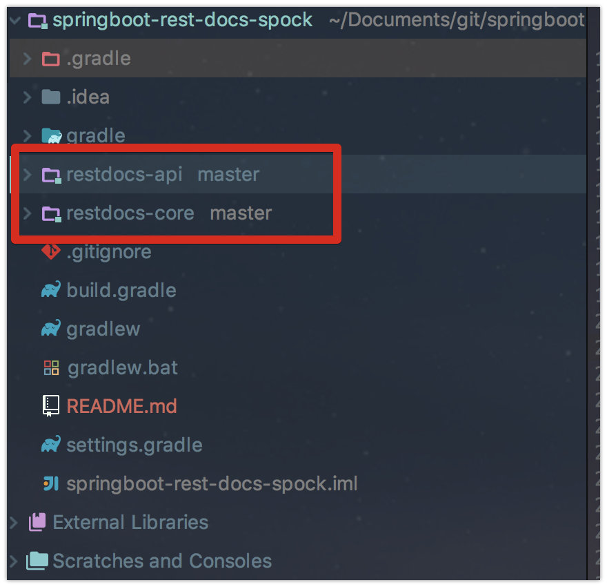
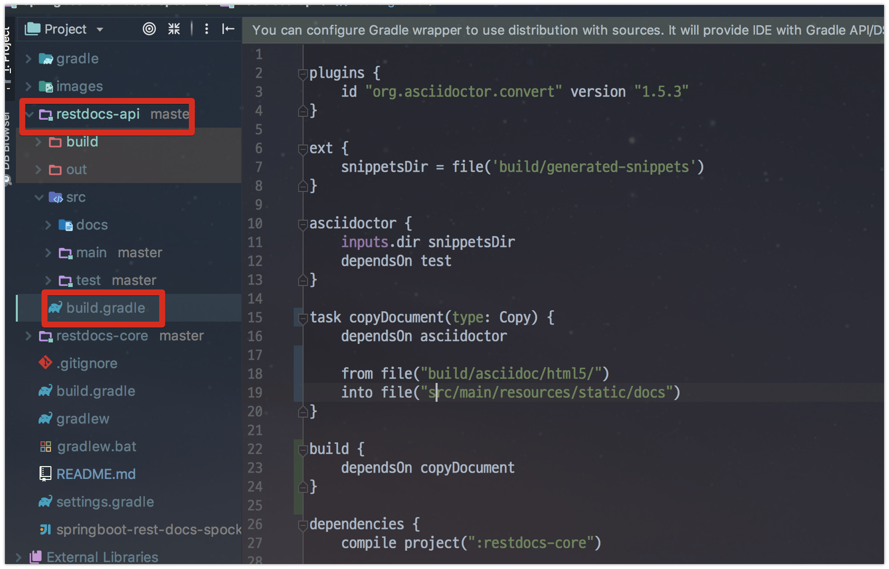
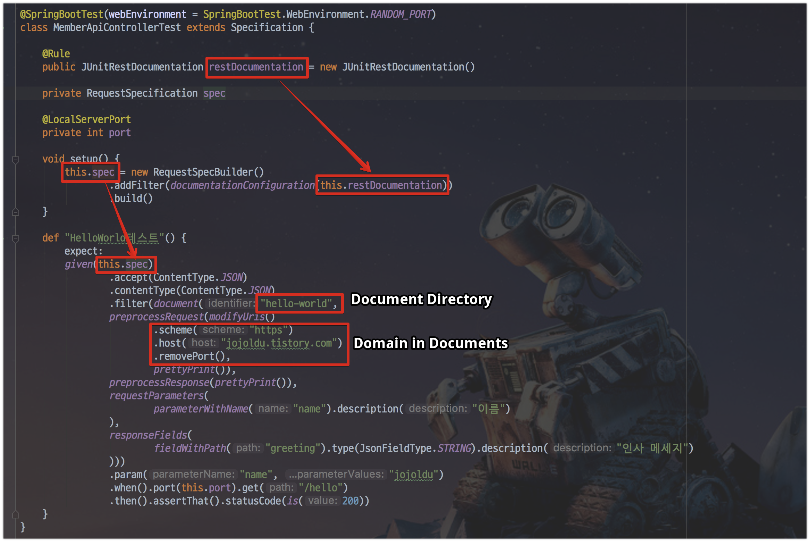
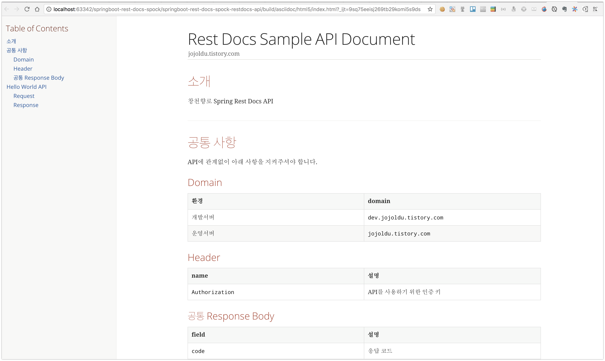
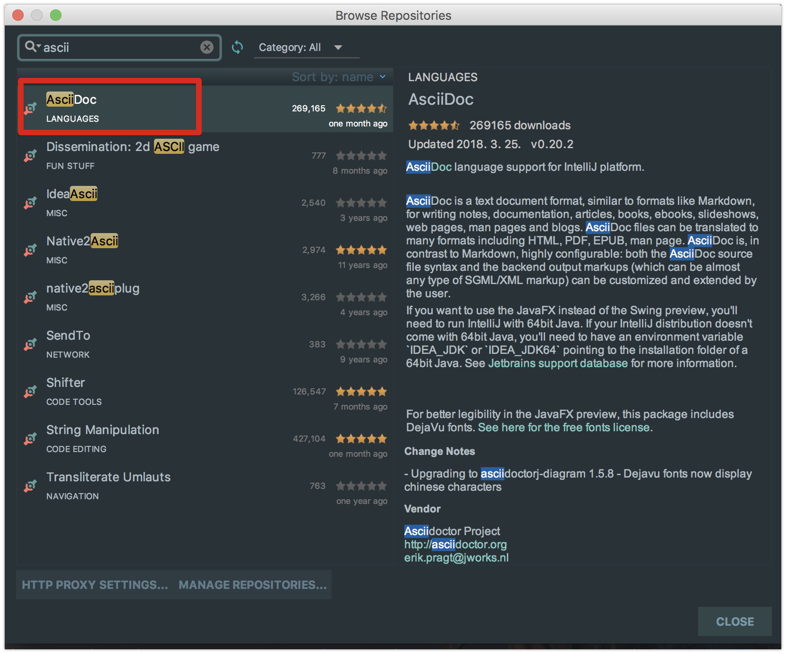
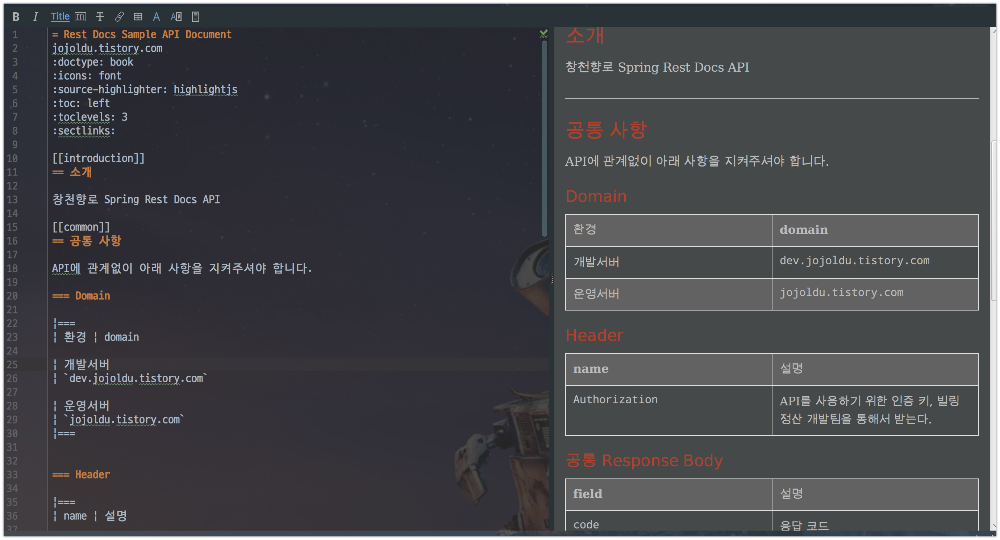

# Gradle Multi Module에서 Spring Rest Docs 사용하기

[지난 시간](http://jojoldu.tistory.com/289)에 이어 이번시간에는 Markdown이 아닌 Asciidoc으로 Spring Rest Docs를 진행하는 과정을 기록합니다.  
  
> 단일 프로젝트에서 기본 버전 (MockMVC + Junit4) 적용 방법은 [레퍼런스 번역](http://springboot.tistory.com/26)을 참고하시면 됩니다.

여기서는 Spring Rest Docs + Spock + Rest Assured를 조합으로 진행할 예정입니다.  
(저희팀 프로젝트 스펙이라서요..)  
  
[Gradle Muliti Module](http://jojoldu.tistory.com/123)의 경우 요즘 많은 프로젝트에서 사용하고 있으니 여기서도 마찬가지로 적용된걸 가정하고 진행합니다.  
  
모든 코드는 [Github](https://github.com/jojoldu/springboot-rest-docs-spock)에 있으니 참고하시면 될것 같습니다.

## 1. Gradle Multi Module 구성

먼저 프로젝트를 Gradle Multi Module로 구성하겠습니다.  



> Gradle Multi Module 구성이 처음이시라면 이전에 작성된 [포스팅](http://jojoldu.tistory.com/123)을 참고해서 한번 시도해보세요!


* 외부에 제공될 API인 restdocs-api 모듈
* 도메인을 담은 restdocs-core 모듈

2가지입니다.  
실제 프로젝트 환경에선 이보다 훨씬더 많은 구성을 가지겠지만, 여기서는 간단하게 2개만 구성해서 진행합니다.  
중요한 점은 **restdocs-api는 Spring Rest Docs로 문서를 제공**하고, **restdocs-core는 문서를 제공하지 않는다**는 것입니다.  
  
그리고 **Root 프로젝트의 build.gradle** 구성을 아래와 같이 간단하게 가져갑니다.

```groovy
buildscript {
    ext {
        springBootVersion = '2.0.1.RELEASE'
    }
    repositories {
        mavenCentral()
    }
    dependencies {
        classpath("org.springframework.boot:spring-boot-gradle-plugin:${springBootVersion}")
    }
}

task wrapper(type: Wrapper) {
    gradleVersion = '4.5.1'
}

subprojects {
    apply plugin: 'java'
    apply plugin: 'groovy' // for spock
    apply plugin: 'eclipse'
    apply plugin: 'org.springframework.boot'
    apply plugin: 'io.spring.dependency-management'

    group = 'com.jojoldu.spring'
    version = '0.0.1-SNAPSHOT'
    sourceCompatibility = 1.8

    repositories {
        mavenCentral()
    }

    dependencies {
        compile('org.springframework.boot:spring-boot-starter')
        compileOnly('org.projectlombok:lombok')
        testCompile('org.springframework.boot:spring-boot-starter-test')
        testCompile('org.spockframework:spock-core:1.1-groovy-2.4') // for spock
        testCompile('org.spockframework:spock-spring:1.1-groovy-2.4') // for spock
    }

}
```

위 내용을 보시면 아시겠지만, Root의 build.gradle은 **서브 모듈들에서 공통으로 사용할 의존성들만 추가**하면 됩니다.  
Spring Rest Docs를 사용할 모듈 (여기서는 restdocs-api)에서만 관련된 코드를 추가하면 됩니다.  
  
나머지 기타 설정들 (settings.gradle 등)은 생략하겠습니다.  

> 나머지 설정을 확인하고 싶으신 분들은 [Github](https://github.com/jojoldu/springboot-rest-docs-spock)을 참고해주세요.

## 2. Spring Rest Docs 설정

Rest Docs 관련된 설정을 추가해보겠습니다.  
해당 설정은 Root프로젝트의 build.gradle이 아닌, **문서가 제공될 restdocs-api에서만** 추가하면 됩니다.  
그래서 아래와 같이 restdocs-api의 build.gradle에만 설정을 추가하겠습니다.



> 하위 모듈이 모두 문서가 필요하면 Root 프로젝트의 build.gradle에 넣으시면 됩니다.  
만약 하위 모듈 중 몇개만 쓰고 싶으시다면 ```configure``` 기능을 사용하시면 됩니다.  
[참고](https://docs.gradle.org/current/userguide/multi_project_builds.html)

build.gradle의 전체 코드는 아래와 같습니다.

```groovy

plugins {
    id "org.asciidoctor.convert" version "1.5.3"
}

ext {
    snippetsDir = file('build/generated-snippets')
}

asciidoctor {
    inputs.dir snippetsDir
    dependsOn test
}

task copyDocument(type: Copy) {
    dependsOn asciidoctor

    from file("build/asciidoc/html5/")
    into file("src/main/resources/static/docs")
}

build {
    dependsOn copyDocument
}

dependencies {
    compile project(":restdocs-core")

    compile('org.springframework.boot:spring-boot-starter-web')

    // rest assured & asciidoc
    compile('org.springframework.restdocs:spring-restdocs-restassured')
    asciidoctor 'org.springframework.restdocs:spring-restdocs-asciidoctor:2.0.1.RELEASE'

    testCompile('io.rest-assured:rest-assured:3.0.2') // for rest assured
    testCompile('org.springframework.restdocs:spring-restdocs-restassured') // for rest assured

}

```

여기서 ```./gradlew build``` 혹은 ```gradle build```등으로 build가 수행될때의 Task 순서는 ```test``` -> ```asciidoctor``` -> ```copyDocument``` -> ```build``` 가 됩니다.

* ```build``` 호출
* ```build```가 ```copyDocument``` Task에 의존(```dependsOn```)하고 있어 ```copyDocument```가 먼저 수행
* ```copyDocument``` 호출
* ```copyDocument```가 ```asciidoctor```에 의존하고 있어 ```asciidoctor``` 호출
* ```asciidoctor``` 호출
* ```asciidoctor```가 ```test```에 의존하고 있어 ```test``` 호출

> Gradle에서 ```dependsOn```은 지정된 Task가 먼저 수행되어야 함을 의미합니다.  
예를 들어 ```dependsOn A``` 라고 되어있으면 A Task가 수행되어야만 원래 Task가 수행됩니다.

자 여기서 ```copyDocument```가 하는 일은 간단합니다.  
Rest Docs로 문서(html)가 만들어지면 ```build/asciidoc/html5/```에 생성되는데요.  
생성된 문서를 ```src/main/resources/static/docs```로 복사하는 것입니다.  
  
스프링부트는 ```src/main/resources/static/``` 아래에 있는 정적 파일(html/css/js/image)는 자동으로 호스팅해줍니다.  
  
예를 들어 ```src/main/resources/static/docs/index.html```이 있다면, **localhost:8080/docs/index.html 혹은 도메인/docs/index.html로 접속하면 문서를 볼수있게 됩니다**.  
  
Rest Docs 설정도 끝났습니다!  
이제는 실제로 테스트 코드를 한번 작성해보겠습니다.

## 3. 테스트 코드 작성

일단 간단한 Controller를 생성하겠습니다.

> Rest Docs는 Controller 테스트 코드를 기반으로 문서를 생성합니다.  

```java
@RestController
public class MemberApiController {

    @GetMapping("/hello")
    public Hello helloWorld(@RequestParam String name){
        return new Hello("Hello World "+name);
    }

    @PostMapping("/member")
    public Member saveMember(@RequestBody Member member){
        return member;
    }

    @Getter
    public static class Hello {
        String greeting;

        public Hello(String greeting) {
            this.greeting = greeting;
        }
    }
}
```

> Member 클래스는 restdocs-core 모듈에서 관리하는 엔티티(Entity) 클래스입니다.  
**restdocs-api가 core 의존성**(```compile project(":restdocs-core")```)을 갖고 있기 때문에 바로 호출해서 사용할 수 있습니다.

그리고 이 Controller를 테스트하는 코드를 생성합니다.  
  
> 참고로 저는 Spock & Rest Assured 기반입니다.  
만약 Junit, MockMVC를 사용하신다면 [공식 샘플](https://github.com/spring-projects/spring-restdocs/tree/v2.0.1.RELEASE/samples)을 참고해보세요

```groovy
import static io.restassured.RestAssured.given
import static org.hamcrest.CoreMatchers.is
import static org.springframework.restdocs.operation.preprocess.Preprocessors.*
import static org.springframework.restdocs.payload.PayloadDocumentation.fieldWithPath
import static org.springframework.restdocs.payload.PayloadDocumentation.responseFields
import static org.springframework.restdocs.request.RequestDocumentation.parameterWithName
import static org.springframework.restdocs.request.RequestDocumentation.requestParameters
import static org.springframework.restdocs.restassured3.RestAssuredRestDocumentation.document
import static org.springframework.restdocs.restassured3.RestAssuredRestDocumentation.documentationConfiguration

@SpringBootTest(webEnvironment = SpringBootTest.WebEnvironment.RANDOM_PORT)
class MemberApiControllerTest extends Specification {

    @Rule
    public JUnitRestDocumentation restDocumentation = new JUnitRestDocumentation()

    private RequestSpecification spec

    @LocalServerPort
    private int port

    void setup() {
        this.spec = new RequestSpecBuilder()
                .addFilter(documentationConfiguration(this.restDocumentation))
                .build()
    }

    def "HelloWorld테스트"() {
        expect:
        given(this.spec)
                .accept(ContentType.JSON)
                .contentType(ContentType.JSON)
                .filter(document("hello-world",
                preprocessRequest(modifyUris()
                        .scheme("https")
                        .host("jojoldu.tistory.com")
                        .removePort(),
                        prettyPrint()),
                preprocessResponse(prettyPrint()),
                requestParameters(
                        parameterWithName("name").description("이름")
                ),
                responseFields(
                        fieldWithPath("greeting").type(JsonFieldType.STRING).description("인사 메세지")
                )))
                .param("name", "jojoldu")
                .when().port(this.port).get("/hello")
                .then().assertThat().statusCode(is(200))
    }
}
```

코드를 하나씩 설명드리겠습니다.



* ```@Rule public JUnitRestDocumentation restDocumentation```
  * 자동 생성될 문서들의 Root 디렉토리를 지정합니다.
  * 기본값으로 Maven은 ```target/generated-snippets```, Gradle은 ```build/generated-snippets```으로 지정되어있습니다.
  * 각 문서들은 위 설정된 Root 디렉토리의 **하위 디렉토리에** 자동생성됩니다.
* ```private RequestSpecification spec```
  * Spock의 모든 Request 요청이 ```restDocumentation```이 적용된채로 진행되도록 설정합니다.
* ```hello-world```
  * ```restDocumentation```로 지정된 디렉토리에 해당 테스트 코드로 생성되는 모든 문서를  ```hello-world```디렉토리에 생성합니다.

## 4. 문서 생성

## 5. 결과



## 6. Tip

### Plugin

IntelliJ를 기준으로는 다음과 같이 Asciidoc 플러그인이 제공됩니다.





> VS Code 등 다른 에디터에서도 플러그인이 제공됩니다.

### 문서 생성 목록

| 기본 생성             | 테스트코드에 따라 추가 생성    |
|---------------------|-------------------------|
| curl-request.adoc   | response-fields.adoc    |
| http-request.adoc   | request-parameters.adoc |
| httpie-request.adoc | request-parts.adoc      |
| http-response.adoc  | path-parameters.adoc    |
| request body        | request-parts.adoc      |
| response body       |                         |