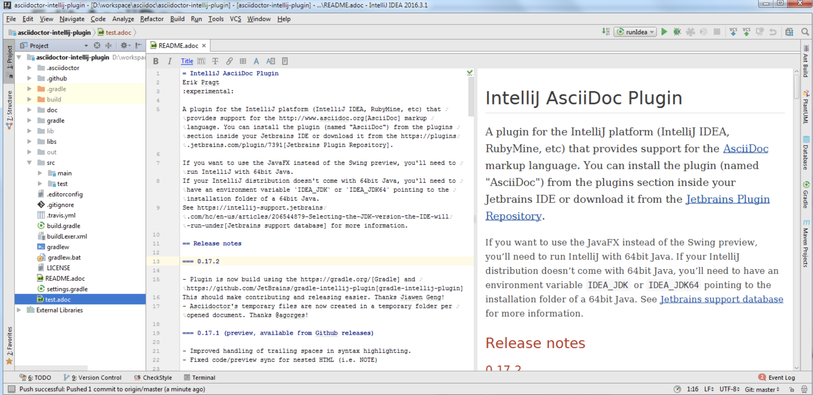
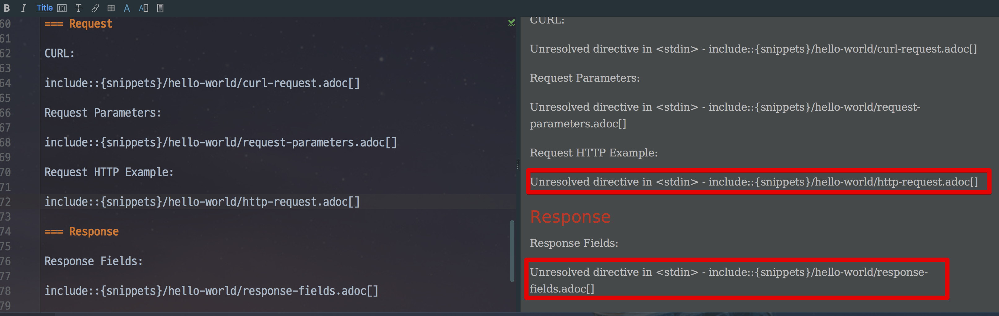
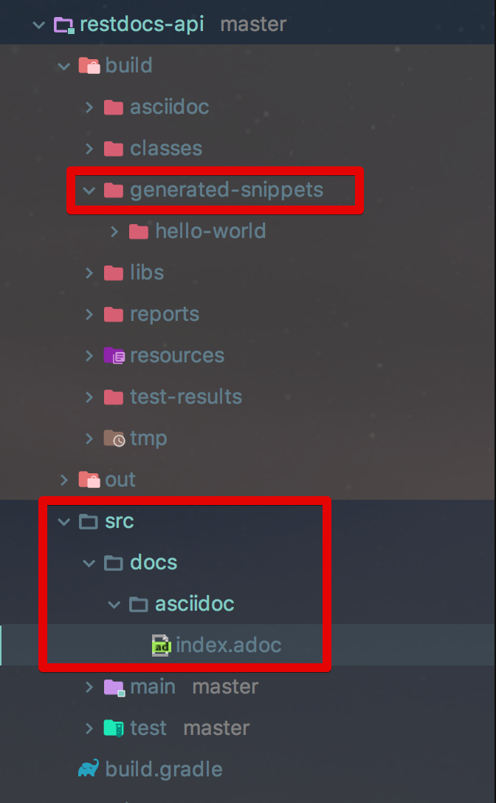
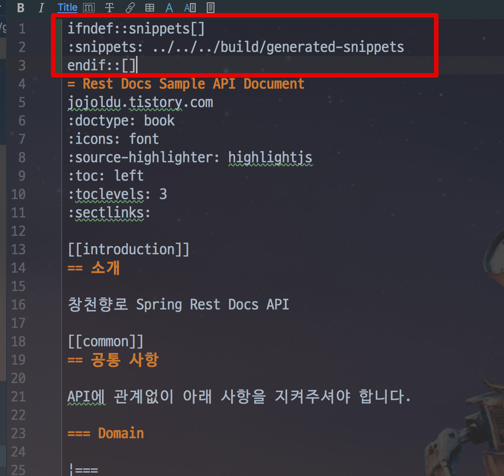
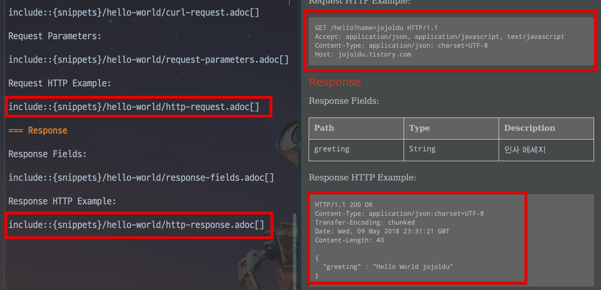

# Spring Rest Docs IntelliJ에서 미리보기

IntelliJ와 Spring Rest Docs를 사용하면 필수로 설치하는게 [AsciiDoc Plugin](https://plugins.jetbrains.com/plugin/7391-asciidoc)입니다.  



(AsciiDoc Plugin)  
  
마크다운 Preview처럼 AsciiDoc 파일을 미리 볼 수 있도록 지원하는 아주 좋은 플러그인입니다.  
하지만 Spring Rest Docs에서는 활용하기가 쉽지 않습니다.  
일반적으로 Spring Rest Docs는 아래처럼 ```{snippets}```을 기준으로 Import 할 adoc 파일 위치를 지정합니다.



하지만 이렇게 ```{snippets}``` Path를 제대로 인식하지 못합니다.  
아시다시피 ```{snippets}```는 Maven/Gradle이 html파일을 만들 때 교체될 변수이기 때문입니다.  
build 후에 굳이 html파일에서 보지 않고, **adoc 파일에서 바로 결과물을 보려면** 한가지 코드만 추가하시면 됩니다.
 
먼저 프로젝트 구조가 다음과 같이 되어있어야만 합니다.



그리고 본인의 build 환경에 맞게 아래 코드를 **index.adoc 최상단에 추가**하시면 됩니다.

**Maven** 

```xml
ifndef::snippets[]
:snippets: ../../../target/generated-snippets
endif::[]
```

**Gradle**

```groovy
ifndef::snippets[]
:snippets: ../../../build/generated-snippets
endif::[]
```

실제 적용 화면



이렇게 코드를 변경하시고, 본인의 ```generated-snippets```에 Spring Rest Docs로 생성한 adoc 파일들이 있다면 바로 볼 수 있습니다.  




